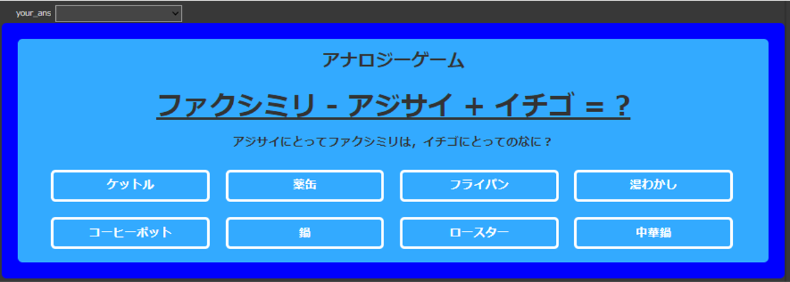

# 兵庫県立大学 社会情報科学部 データ分析研究会（香山）
## オープンキャンパス2023用リポジトリ

- [セグメンテーション](#section1)
- [画像生成](#section2)
- [単語類推クイズ](#section3)
---
## セグメンテーション[:camera:webcam_SAM.ipynb](webcam_SAM.ipynb) 
写真を撮影して領域ごとに分割した結果を出力 
 
入力された画像を意味的な領域ごとに分割して色分けするコード

参考サイト
- https://github.com/facebookresearch/segment-anything
- https://qiita.com/PoodleMaster/items/480b1da080282b15b584

## 画像生成[:movie_camera:waterfall.ipynb](waterfall.ipynb)
mp4動画を取り込んでもらって，それを圧縮したものを用いた予測を行い，展開したものを動画化しています 
好きな次元数に圧縮してみて，傾向を見てみる 

## 単語類推クイズ[:fire:quiz_game_v2.ipynb](quiz_game_v2.ipynb)
単語を演算した結果としてどんな単語と（ある種の意味的に）近くなるのか当ててみよう

